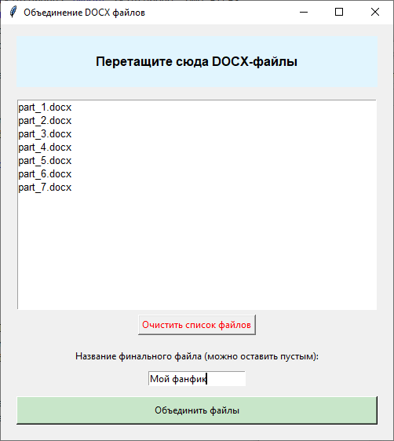

# Ficbook docx divider
Разделитель docx-файлов для лёгкой публикации на Ficbook. Установить пакеты из requirements с помощью файла install.bat, запустить скрипт, импортировать файл и ввести разделитель, используемый вами между главами (это могут быть звёздочки, слово "Глава" и т.д.), нажать кнопку "Применить". Скрипт создаст папку по пути исходного документа с его же названием, в которой будут сохранены файлы `part_{номер части}.docx`.

# Ficbook docx uniter
Объединитель docx-файлов в один. Установить пакеты из requirements с помощью файла install.bat, запустить скрипт, перетащить мышкой нужные файлы на выделенную область, ввести название объединённого файла (если не ввести, то создаваемый файл будет назван "Объединённый документ.docx"), нажать кнопку. Скрипт создаст объединённый файл в той же папке, где лежали исходные.

